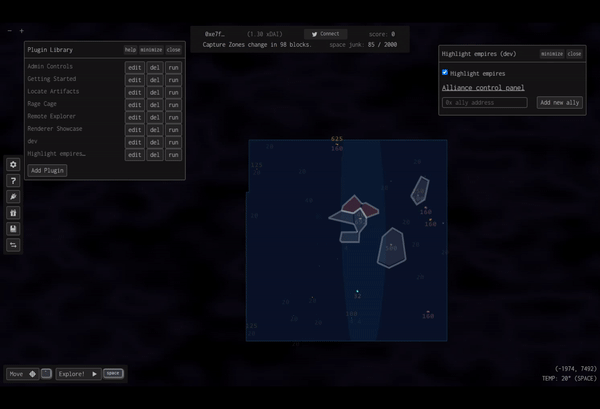

# highlight-empires

The plugin allows users to improve the readability of player-owned empires on the map.

## Dev

Plugin region calculations based on Voronoi algorithm and uses [voronoi](https://www.npmjs.com/package/voronoi) library. You can prepare js file with `build.bash` which will generate `lib/plugin.js` and replace imports from `cdn.skypack.dev`.
